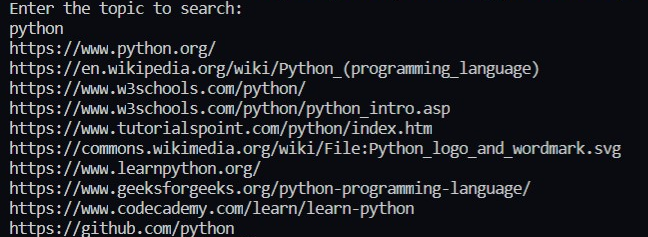

# Google-Search<br>
### Description
Its quite handy to perform a google search using python. It shows the top URLs for the required query.

### Tools and Languages:


<br>

### Installing Libraries
```cmd
pip install beautifulsoup4
pip install google
```

### Important Functions
```python
search(query, tld='com', lang='en', num=10, start=0, stop=None, pause=2.0)
```

### Steps to follow
-Install the given libraries<br>
-Download the code from the given github repository<br>
-Run the code<br>
-Enter your desired search<br>

### Breaking the code
```python
try: 
    from googlesearch import search 
except ImportError:  
    print("No module named 'google' found") 
```

This code fragment tries to import the search function from googlesearch module and throws and error if for any issue the module couldn't be imported.

```python
print("Enter the topic to search: ")
query = input()
```

Taking input from the user. The user can input their desired search in the search option.

```python
for j in search(query, tld="co.in", num=10, stop=10, pause=2): 
    print(j) 
```

The search function returns the URLs of all the relevant searches.

### Sample Optput


### Developed by:
<a href="https://github.com/ankush0939">Ankush Mishra</a>

